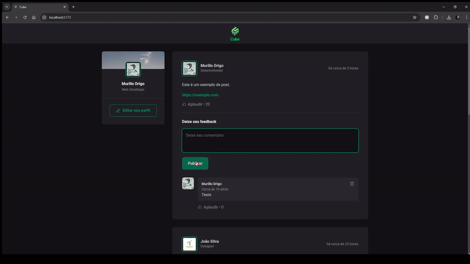
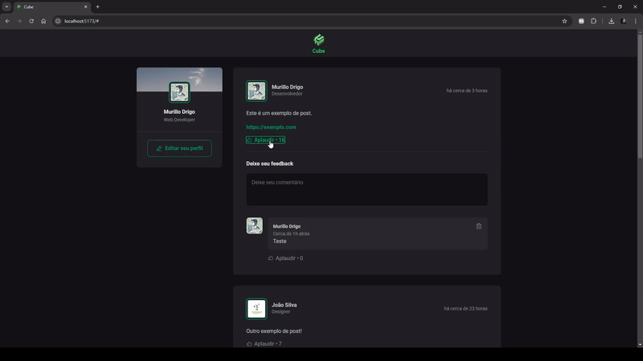

# Cube

**Cube** é uma aplicação de rede social minimalista construída com **React**, **Vite** e **json-server** para gerenciamento de dados. O objetivo do projeto é permitir a criação e visualização de postagens, adicionar comentários e interagir com os posts por meio de um sistema de "likes" ou "aplausos".

## 📋 Funcionalidades

- **Publicação de Postagens**: Cada postagem inclui informações sobre o autor, conteúdo e data de publicação.
- **Comentários**: Usuários podem adicionar comentários às postagens, e esses comentários são armazenados no servidor.

- **Sistema de Aplausos**: Cada comentário pode receber "aplausos" (likes), que são contados e armazenados no servidor.

- **Integração com json-server**: A aplicação usa json-server como uma API REST simulada para persistir dados.

## 🛠️ Tecnologias Utilizadas

- **React** e **Vite**: Framework e ambiente de desenvolvimento para construção da interface.
- **TypeScript**: Fornece tipagem estática para melhorar a qualidade do código.
- **json-server**: Simula uma API REST para persistir os dados de postagens e comentários.
- **Tailwind CSS**: Utilizado para estilização rápida e eficiente dos componentes.

## 📂 Estrutura do Projeto

- **db.json**: Arquivo que contém os dados simulados para json-server.
- **src/components**: Contém os componentes principais da aplicação.

## 🚀 Pré-requisitos

Certifique-se de ter o **Node.js** e o **npm** instalados em seu sistema.
